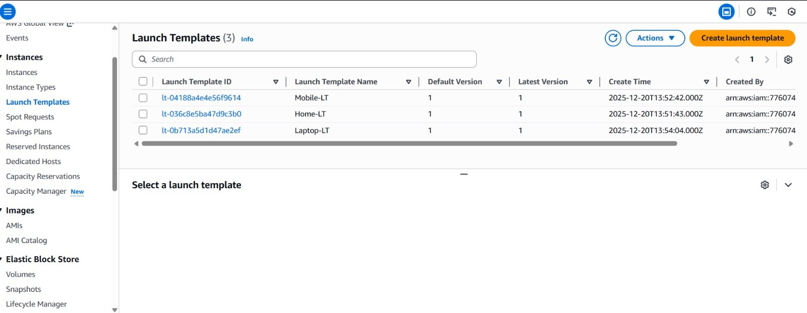
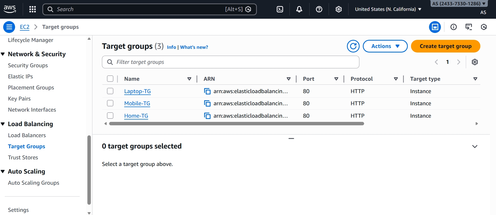
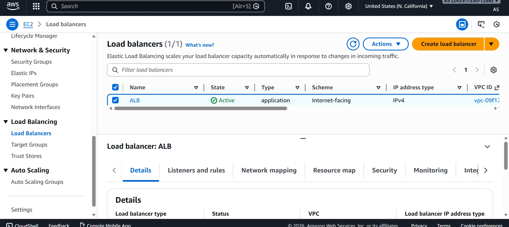
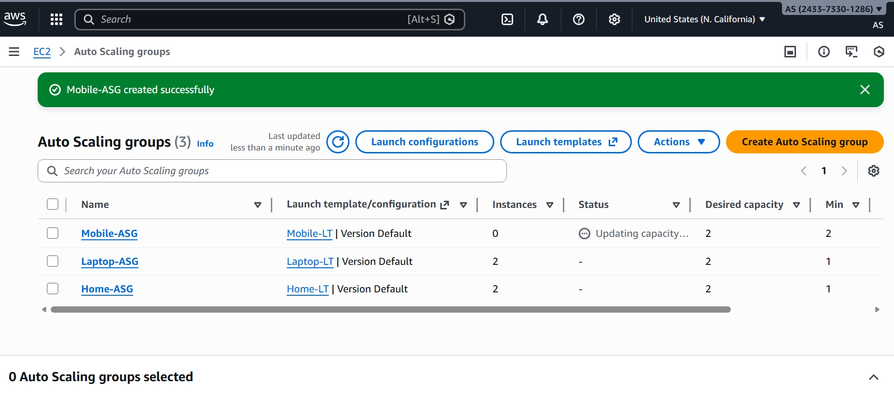

## **Auto Scaling Group with Application Load Balancer Project**

### Introduction:

* This project demonstrates how to deploy a scalable and highly available web application on AWS using an Application Load Balancer (ALB) and an Auto Scaling Group (ASG). The ALB distributes incoming user traffic across multiple EC2 instances. The ASG automatically increases or decreases the number of instances based on traffic demand. This setup ensures continuous application availability even during high load. It also improves performance and optimizes cost by using resources efficiently.

* **ASG-(Auto Scaling Group)**

  An Auto Scaling Group (ASG) is an AWS service that automatically manages EC2 instances. It increases the number of instances when traffic is high and decreases them when traffic is low. This helps keep the application running smoothly without manual work. ASG also replaces failed instances automatically. Overall, it improves availability, performance, and saves cost by using only the required resources

* **ALB-(Application Load Balancer)**

  An Application Load Balancer distributes incoming traffic across multiple targets **(EC2, containers, IPs,etc.)** in one or more Availability Zones. Also it Health checks ensure traffic is only sent to healthy
targets

#### **AWS Services Used**:
- **EC2**: Runs the web application
- **Auto Scaling Group (ASG) :** Automatically increases or decreases EC2 instances based on traffic

- **Application Load Balancer (ALB) :** Distributes incoming requests across healthy instances

- **VPC & Subnets :** Provide secure network and availability across zones

- **Security Groups :** Control traffic access to instances and ALB


#### **Project Overview :**
* This project shows how to use Auto Scaling Group **(ASG)** and Application Load Balancer **(ALB)** to run a web application on AWS. Traffic is evenly distributed across EC2 instances, and resources automatically scale based on demand. This ensures high availability and better performance.

#### **ARCHITECTURE :**


#### **Step-By-Step-Implementation :**

##### **Step 1: Create Launch Templete :**

*  Open AWS Console → EC2
*  Click Launch Templates → Create launch template
*  Enter template name
*  Select AMI (OS image)
*  Choose Instance type (e.g., t3.micro)
*  Select Key pair
*  Choose Security group
*  Add User data script
* Click Create launch template



#### **Step 2: User Data Scripts :**

1. **Home User Script (Dynamic ASG) :**
```
 #!/bin/bash 
sudo yum update -y  
sudo yum install -y httpd  
sudo systemctl start httpd 
sudo systemctl enable httpd  
echo "<h1>This is Home page $(hostname -f)</h1>" > /var/www/html/index.html
```
2. **Mobile User Script (Static ASG)**
```
#!/bin/bash 
sudo yum update -y  
sudo yum install -y httpd  
sudo systemctl start httpd sudo  
systemctl enable httpd 
sudo mkdir /var/www/html/mobile  
echo "<h1>This is mobile page $(hostname -f)</h1>" > 
/var/www/html/mobile/index.html
```
3. **Laptop User Script (Scheduled ASG)**
```
#!/bin/bash 
sudo yum update -y  
sudo yum install -y httpd  
sudo systemctl start httpd  
sudo systemctl enable httpd 
sudo mkdir /var/www/html/laptop 
echo "<h1>This is laptop page $(hostname -f)</h1>" > 
/var/www/html/laptop/index.html
```
#### **Step 3 : Create Target Group :**

**Steps to create TG :**
 * Open AWS Console → EC2
 * In the left menu, click Target Groups
 * Click Create target group
 * Enter Target group name
 * Choose Protocol & Port (e.g., HTTP, 80)
 * Configure Health checks - select path
 * Click Next and Register targets (optional)
 * Click Create target group


#### Create Three Target Groups 
* **Home Target Group**
* **Mobile Target Group**
* **Laptop Target Group**


 

#### Step 4 : Create Application Load Balancer:

* Open AWS Console → EC2 Dashboard

* From left menu, go to Load Balancing → Load Balancers

* Click Create load balancer → Application Load Balancer

* Enter Load balancer name, choose Internet-facing

* Select Protocol = HTTP, Port = 80

* Under Security groups, select or create one that allows HTTP (80)

* Under Listeners, choose your Target Group (created earlier)

* Review all settings and click Create load balancer

**Configure Listener Rule**

1. /(default) → Home Target Gorup
2. /mobile/* → Mobile Target Gorup
3. /laptop/* → Laptop Target Gorup



#### Step 5 : Create an Auto Scaling Group

* Open AWS Console → EC2 → Auto Scaling Groups
* Click Create Auto Scaling group
* Enter ASG name, then select your Launch Template
* Choose VPC and Availability Zones / Subnets
* Under Load balancing, choose Attach to existing ALB Target Group
* Set Desired, Minimum, Maximum instance count (e.g., 2 / 1 / 4)
* Configure Scaling policies if needed (CPU-based recommended)
* Review everything and click Create Auto Scaling group




#### *Step 6 : Auto Scaling Configuration Used in the Project*

* **Home Users – Dynamic Auto Scaling Group**

  The Home ASG is configured with dynamic scaling policies to automatically adjust capacity based on
real-time demand

   * Minimum Instances: 1
   * Desired Instances: 2
   * Maximum Instances: 4

* **Mobile Users – Static Auto Scaling Group**

    The Mobile ASG uses a fixed (static) scaling configuration, maintaining a constant number of EC2
  instances at all times.

    * Minimum Instances: 2
    * Desired Instances: 2
    * Maximum Instances: 2

* **Laptop Users – Scheduled Auto Scaling Group**

  The Laptop ASG utilizes scheduled scaling to match predictable usage patterns, scaling resources based
on time-based schedules.

    * Minimum Instances: 1
    * Desired Instances: 1
   * Maximum Instances: 3

#### Application Testing-

* **Input**

 * Home ASG Testing: http://<ALB-DNS>/home
 * Mobile ASG Testing: http://<ALB-DNS>/mobile
 * Laptop ASG Testing: http://<ALB-DNS>/laptop

#### Output:


#### **CONCLUSION :**

This project was successfully completed by implementing an Auto Scaling Group with an Application Load Balancer, demonstrating how scalable and highly available architectures are built on AWS. The setup automatically adjusts EC2 instances based on traffic demand, ensuring consistent performance and optimal resource utilization. By distributing traffic through the Load Balancer and enabling auto scaling, the application achieves high availability, fault tolerance, and cost efficiency. This project provides valuable hands-on experience in designing real-world cloud infrastructure, making it highly relevant for AWS Cloud Engineer


